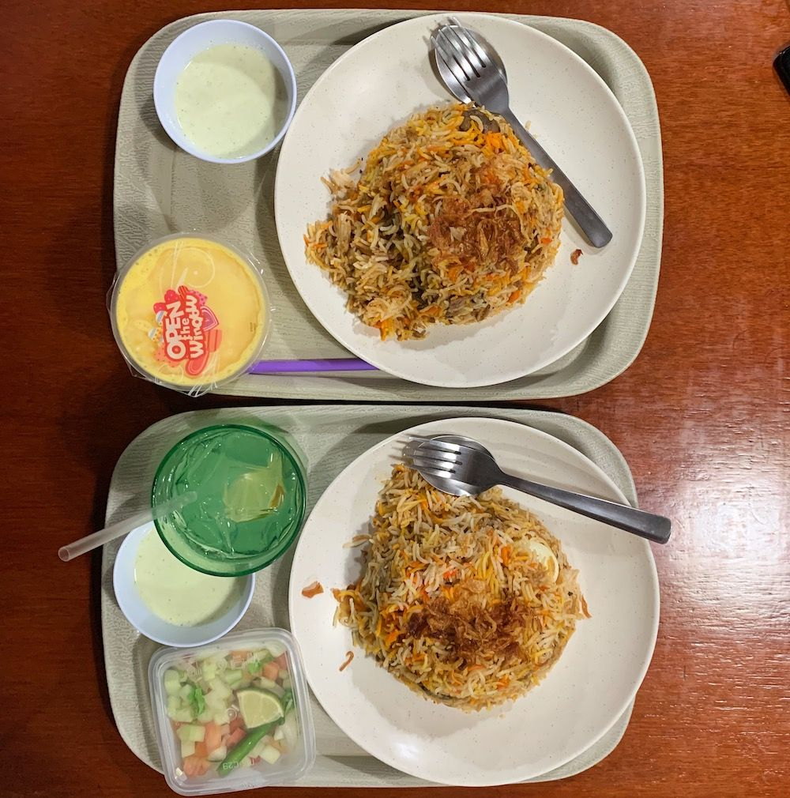
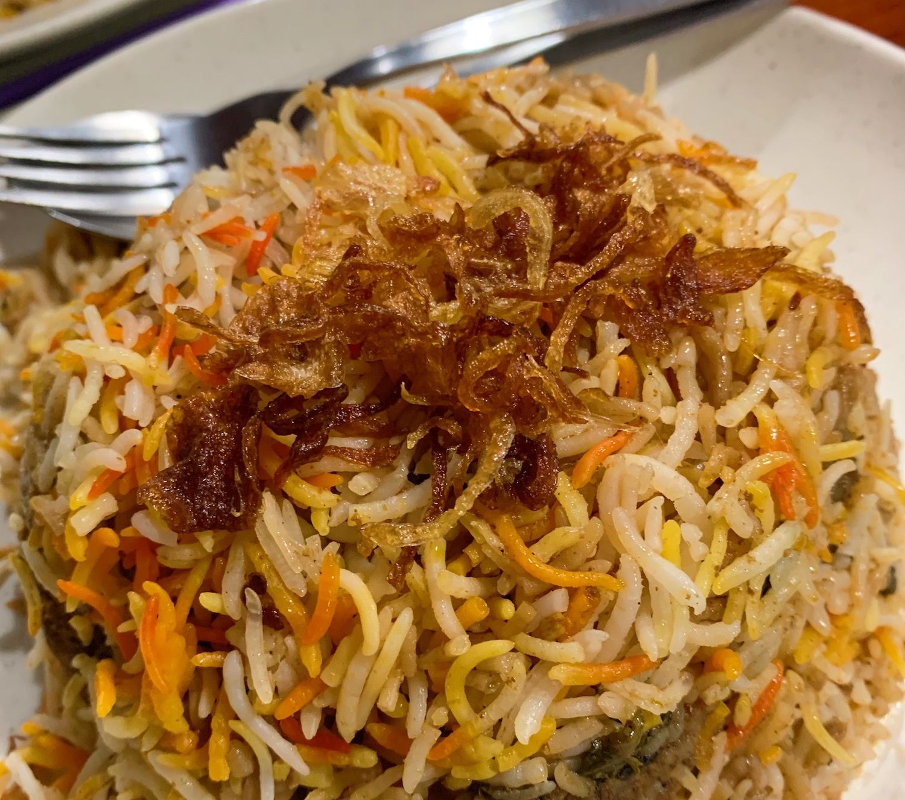
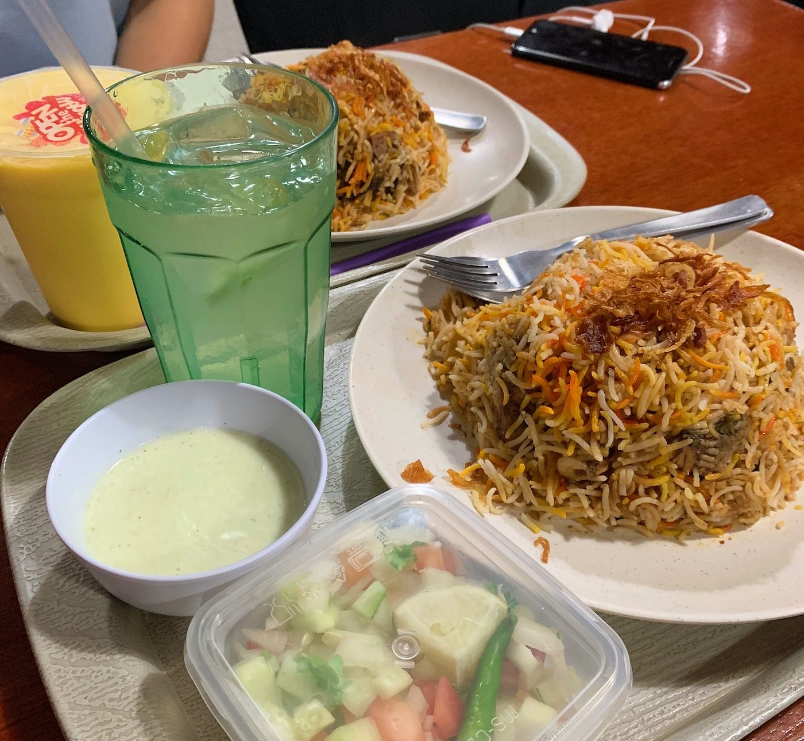

I was meeting my friend Emma for dinner and this place was conveniently located for us, so we decided to try it out.

The restaurant doesn’t have an overly inviting atmosphere.
Bright and cold lights, chairs covered with brown fabric and heavy dark table cloths didn't really make it a comfortable place to hang around...
Also, there were hardly any customers in there.
I don’t think I would have tried this restaurant if it hadn’t come recommended.

You have to order at the counter by the door.
The menu has quite a few options but is not overwhelming.
We sat down and took our time deciding.
I wanted to go for the fish biryani and Emma chose the mutton one. 

Unfortunately the fish option wasn't available, so I went with chicken instead.
I had a lime and salt drink and my friend got a mango lassi.
We decided to order a salad on the side which lead to a bit of a weird situation.

When Emma ordered the salad, the two people at the counter made some sort of comment and were laughing a bit.
Emma thought that maybe the salad was unavailable too, just like the fish biryani.
But they explained that they have some internal joke about who orders the salad.
And that they knew that Emma would order the salad.
So I guess all western looking women like to eat raw vegetables on the side? 🤷

When the food was ready we picked it up from the counter in the back of the room. 

And against all the odds of the overall experience in that restaurant, the food was really good! I mean, the biryani was.

I tried both the mutton and the chicken and both meats were soft and falling off the bone.
The rice tasted great.
I would definitely go there again!

The salad was not great.
I mean… it tasted pretty much how you would expect by looking at it in the photo.
So maybe don’t order that.

But the biryani… yum!!!

## Our ratings

Rabea’s rating: 8.5/10

Emma’s rating: 8/10
