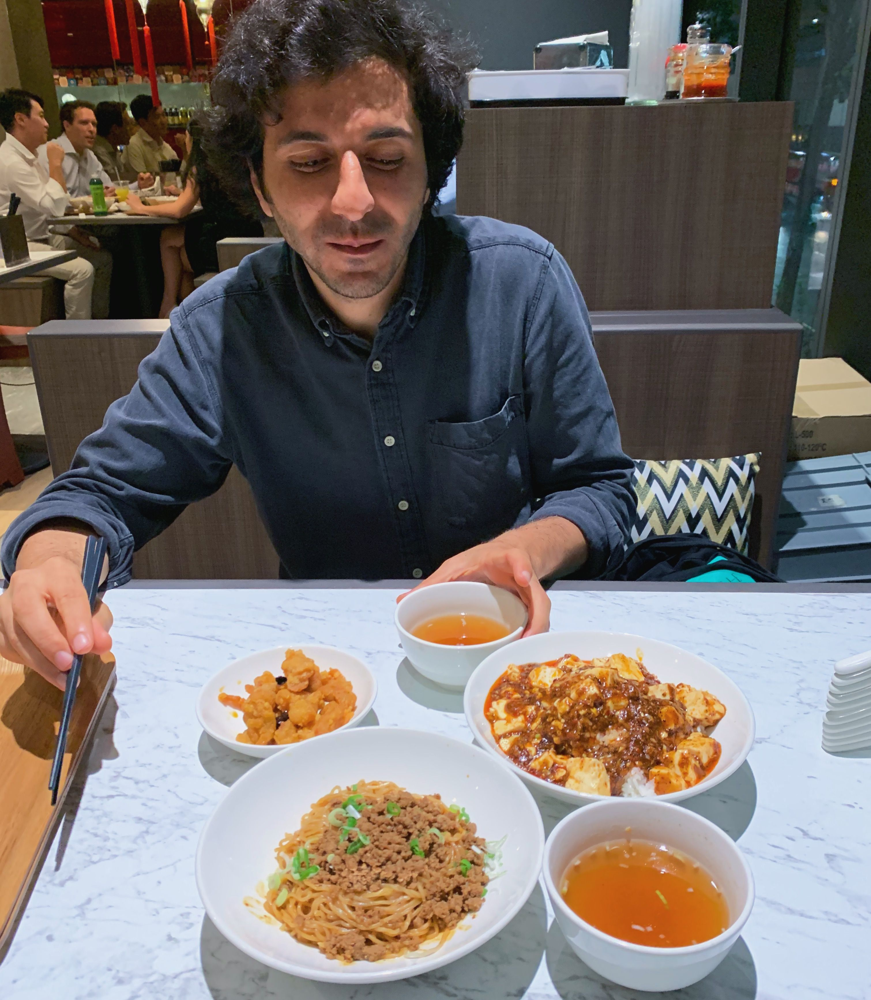
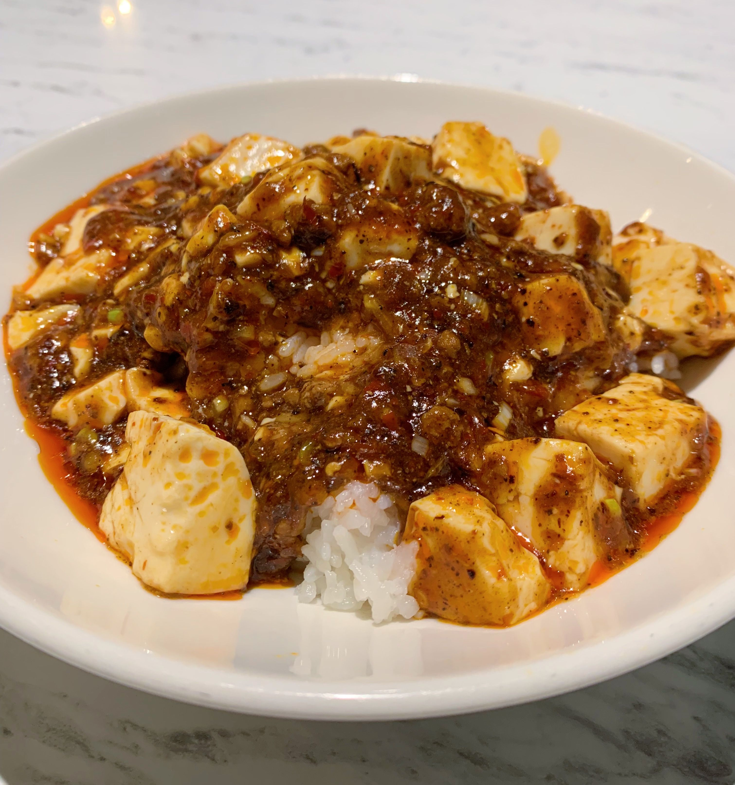

I was excited to finally try one of the much discussed (in food blogger communities) Bib Gourmand restaurants of the 2019 list.
So on a Thursday night we decided to go get our Mapo Tofu fix (that's how food bloggers write, isn't it?) at Chen’s.

I was fearing long queues but luckily there were empty tables in the restaurant and the service was very quick.
You order at the counter when you come in, then find a table and wait for your number to be called.

We ordered the three dishes that were recommended by the Michelin guide: Mapo Tofu Don, Dan Dan Mien and Sichuan Popcorn Chicken.

The Mapo Tofu was really good. It could have been a bit more spicy but maybe that’s the appeal - you get the fun tingling of the Sichuan pepper but you don’t burn your mouth. It’s on a bed of Japanese rice which was very nice. Overall this dish was very tasty and I would highly recommend getting it. I was just missing a bit of the spiciness.

The Dan Dan Mien was ok. Not bad, but not overly amazing. I would eat them again but I wouldn’t go out of my way to do that.

Lastly, the Popcorn Chicken… it wasn’t very good at all.
No Sichuan flavouring… It had some chillis but it didn’t really taste spicy or tingly.
It was also very oily.
Not bad, it was edible but I didn’t even feel like finishing it when I started to get full.

## Our ratings

Rabea's rating: 5/10

Arash's rating: 7/10
