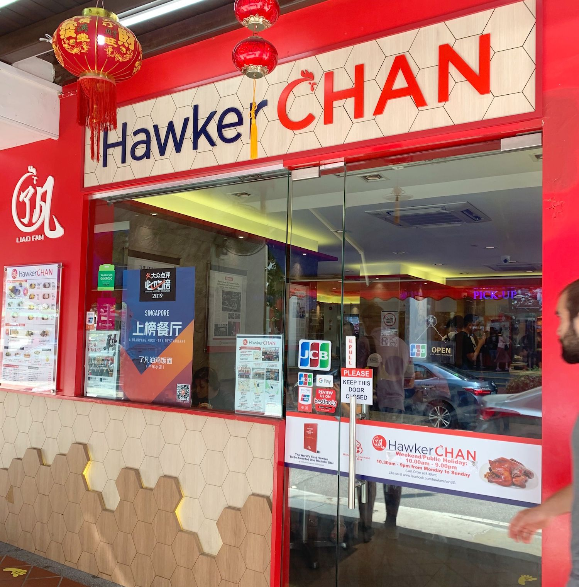
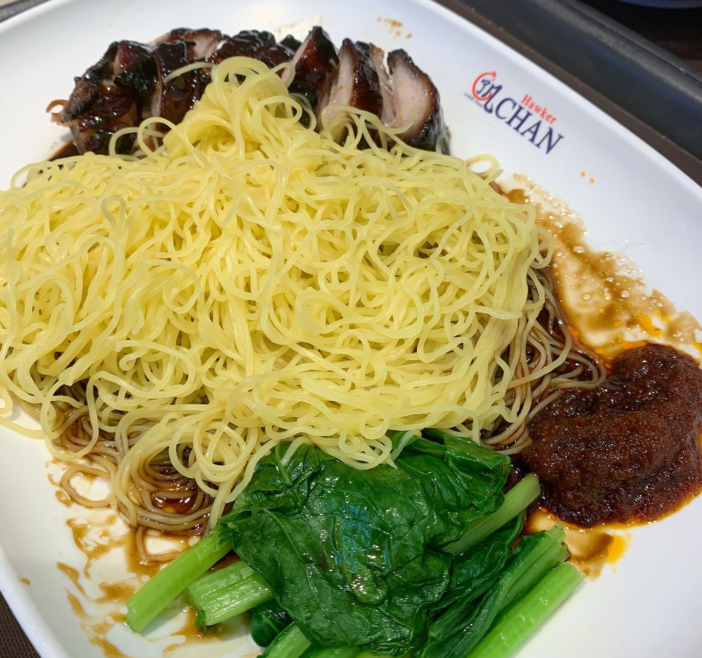

Today I felt like having a tasty, no frills, down to earth lunch. Looking at [the map](/), I decided that Hawker Chan would fit this category - and it hit the spot!

The food was very tasty, affordable and straight forward. Exactly what I wanted.

Hawker Chan is on Smith Street in China Town between several small shops selling Chinese herbal medicines and other things that I don't understand. I expected that it would be an actual hawker stall but it turned out to be a little fast food style restaurant. 

The ordering process was self-service and it was very well organised - you joined the queue to place your order, got a number and then waited for the number to pop up on the screen to collect your food.

There were a few people ahead of me in the queue but I don’t think I waited more than 5 minutes to place my order and then around 10 minutes to receive the food.

We ordered the signature soya sauce chicken rice dish, the Char Siew Pork Noodle, the seasonal greens as a side and the Aiyu Aloe Vera dessert.

It was a good amount between the two of us. The vegetable side dish was actually a pretty big portion! All of that came to SG$18 - so I can’t complain really!

And the food was really good. I would definitely go again. Both kinds of meat were tasty - maybe I would slightly prefer the pork over the chicken because the pork fat was so nice and crispy. And the chicken bones curbed my eating pleasure a bit. The taste was great though. I enjoyed both.

I think I preferred the combination of meat and rice rather than noodles, so my favourite dish would probably be the pork combined with the rice.

That said - there are other types of meat too, which I would definitely like to try. I have to go back soon!

The dessert was not very good... I guess it's not what this restaurant is famous for, so I shouldn't have got it. I later saw on Google maps that there was a dessert cafe close to Hawker Chan... we should have gone there rather than eat the Aloe Vera dessert. 

## Our ratings

Rabea's rating: 9/10

Arash's rating: 7.5/10
