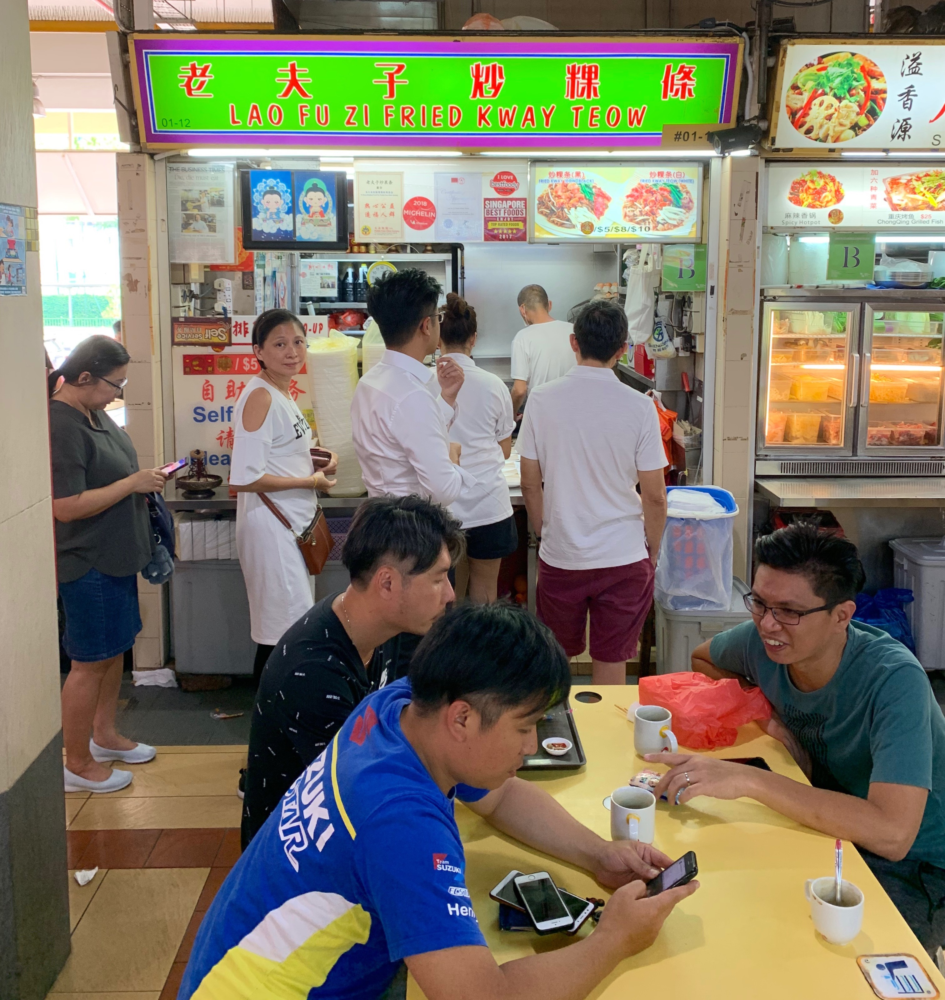
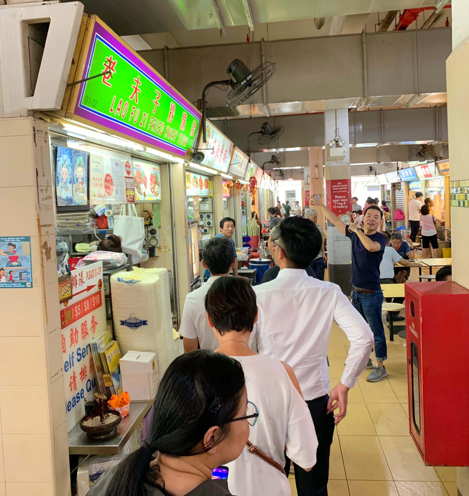
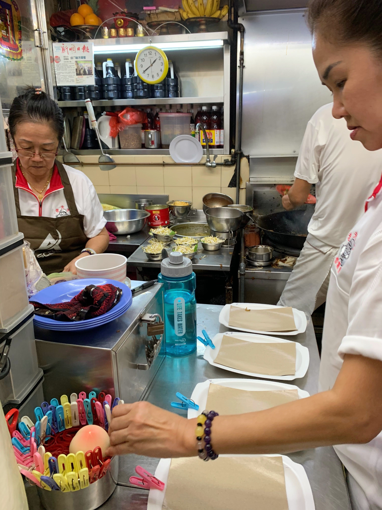
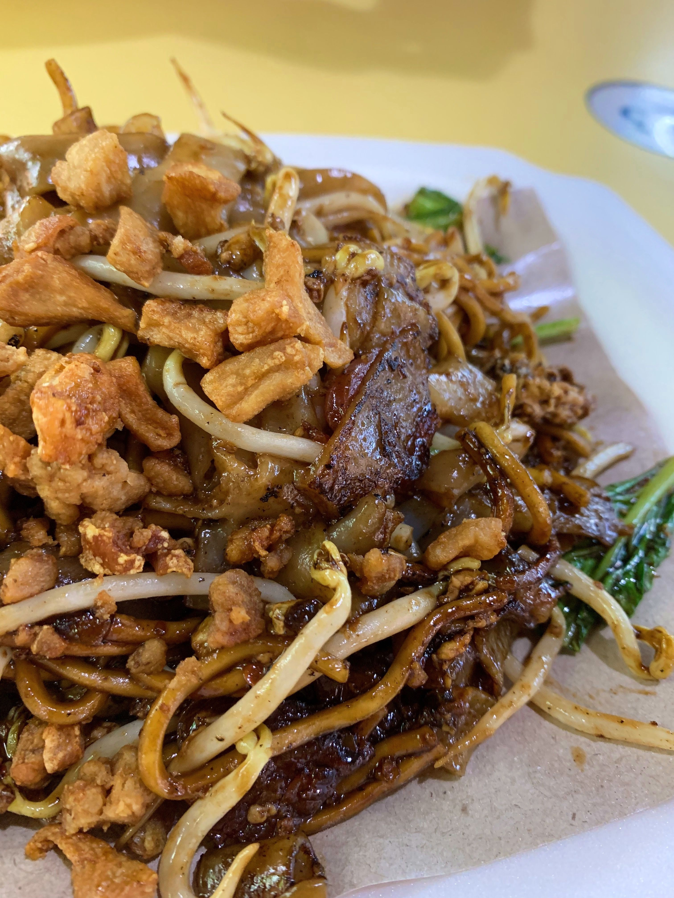
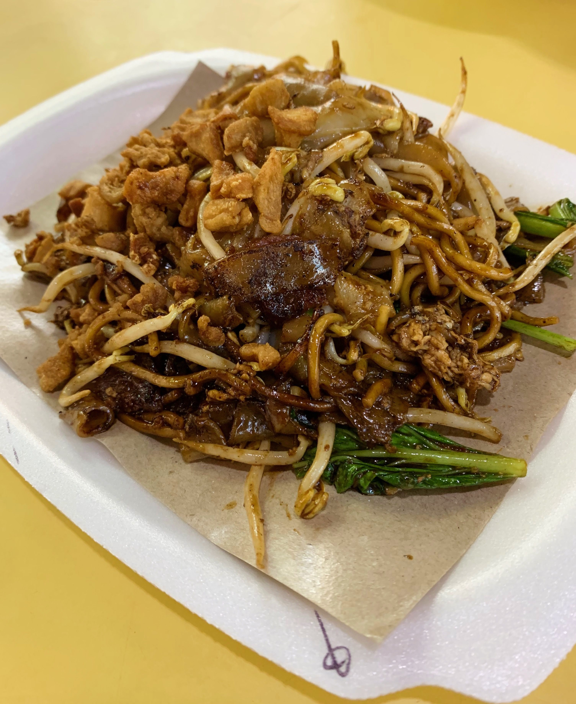

Today my friend Bryan and I tried another Bib Gourmand destination at Old Airport Road hawker centre: Lao Fuzi Fried Kway Teow.

Bryan is a Singapore local and experienced Char Kway Teow eater, so I was glad to have his expert opinion by my side for this tasting session.

We arrived just before 1:30pm and there was a bit of a queue, so we had to wait for approximately 10-15 minutes before being able to order. (In the mean time Bryan got some Mala from the place next door - it was ok, but I wouldn’t necessarily recommend it.)

The Char Kway Teow came in three different portion sizes: $5, $8 and $10.

Also, spot the magazines about meditation and health in the photo... I guess if waiting times get really long and you've read all of Twitter, you can always fall back to one of those.

We ended up ordering the $5 portion and I'd say that it's a good portion for one person. But not enough to share between two if you have nothing else. (We had the mediocre Mala, so that was ok.)

Once the order was in, it took another 5 minutes for the noodles to be served to our table in front of the stall. The chef does a really cool dance while stir-frying the food, definitely watch out for that.

The food looked amazing with fried lard bits sprinkled on the top. The taste was really good. I definitely enjoyed it and would order it again any time. But it didn’t blow me away. I’m sure I’ve had similar tasking Char Kway Teow before. Not sure what this one makes it so special to get the Bib Gourmand award.

I also think the whole experience could have been improved if they hadn’t given us those flimsy disposable chopsticks and a plastic spoon. Maybe that's the Old Airport Road hawker centre way though... But those plastic spoons have sharp edges which is a bit unpleasant on the lip feel...

But, you might be wondering, how did my local Char Kway Teow experienced companion rate this dish?

Bryan also thought the food was good but he felt that it didn’t have enough "wok hei" - that charred flavour that food can get when cooked in a very hot wok. He also felt that the dark sauce wasn’t mixed well enough. Mixing in the lard bits, rather than sprinkling them on top, might have improved the dish.

## Our ratings

Rabea's rating: 7.5/10

Bryan's rating: 8/10 (there are better places)
