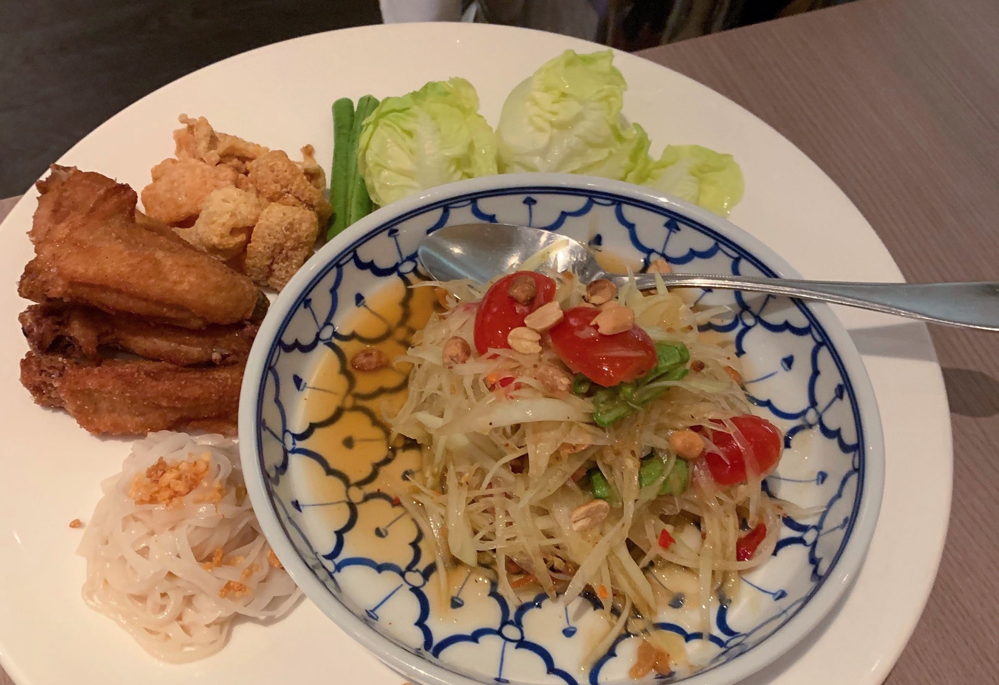
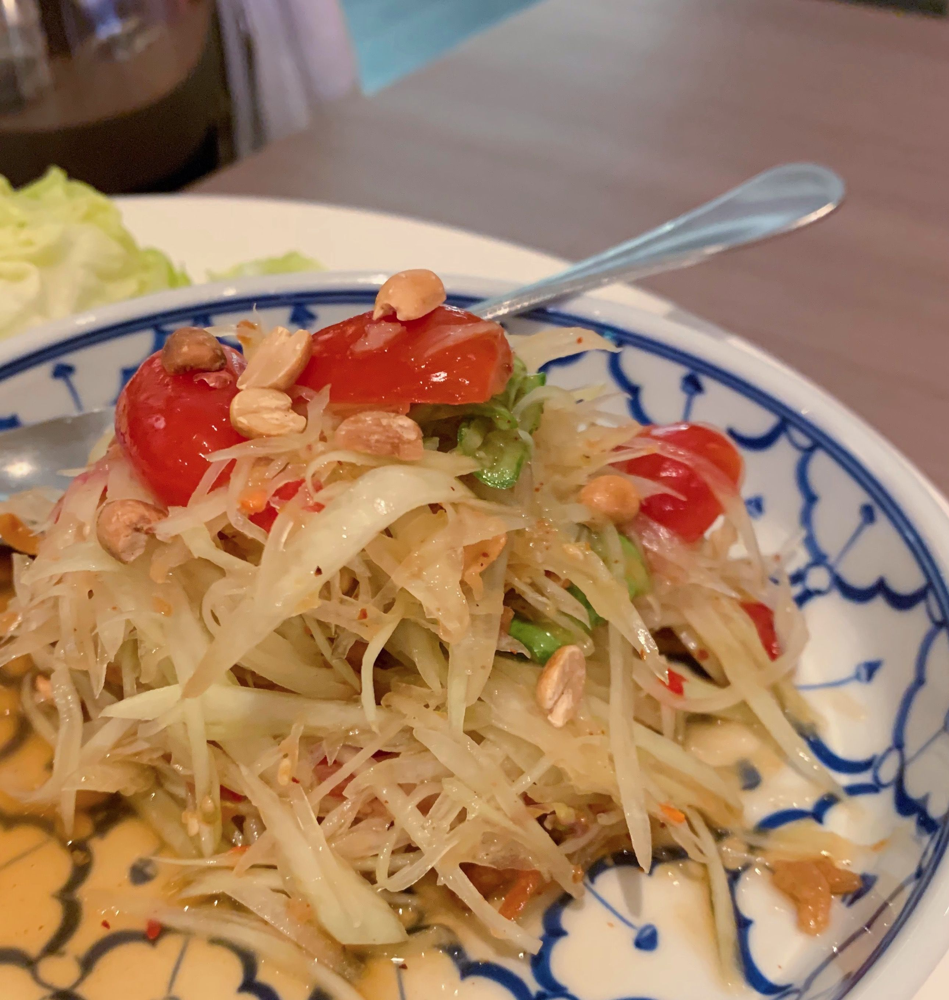
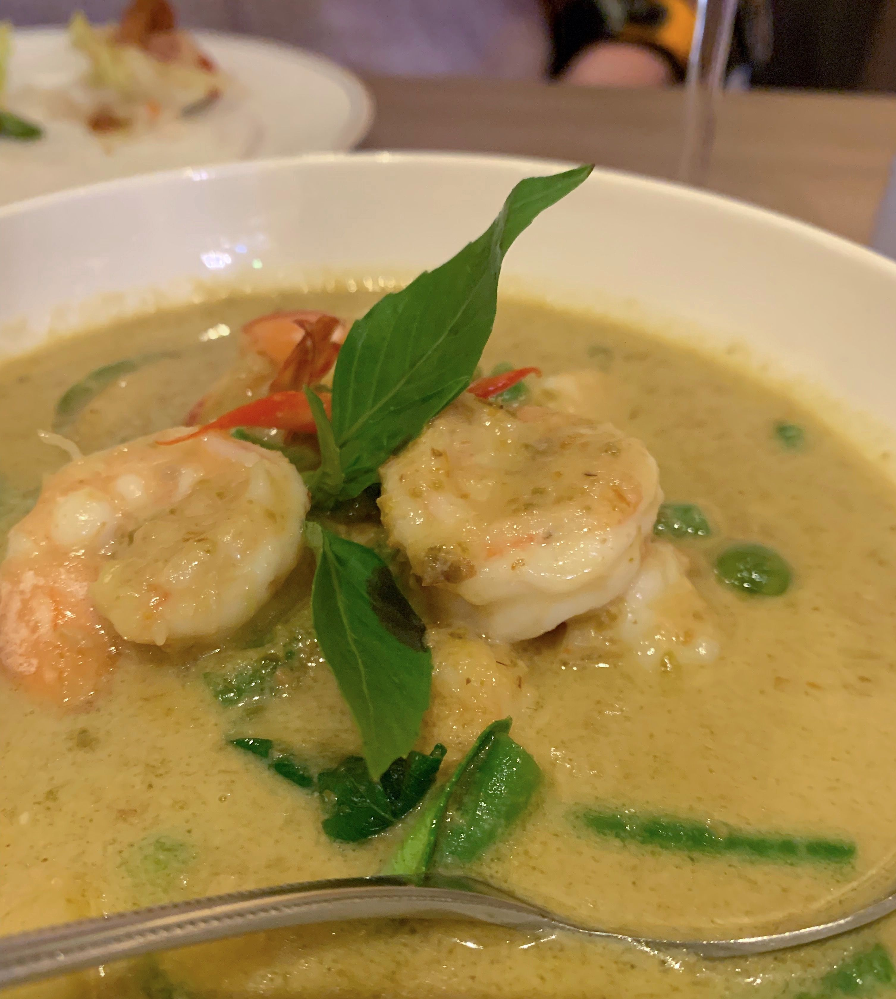
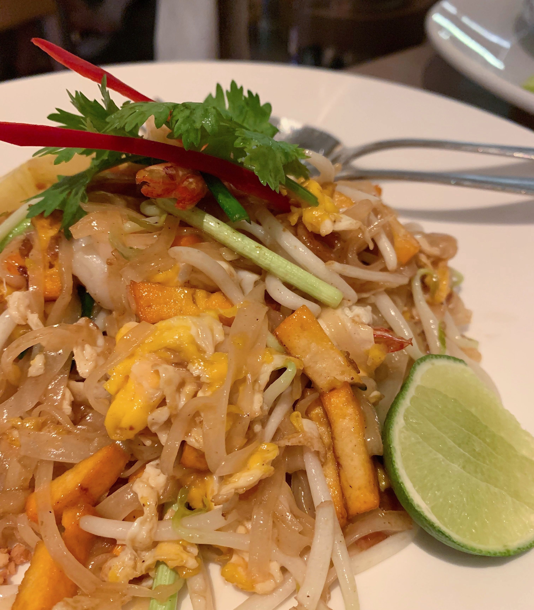
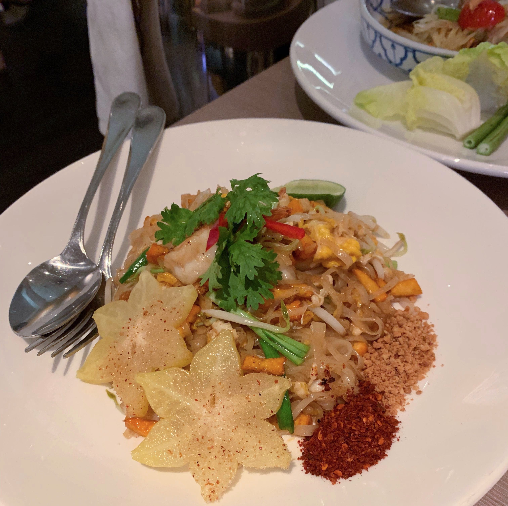

My friend had reserved a table for us at 6:30pm - but when we arrived the place was pretty much empty. Granted, it was a Tuesday night, so maybe not the busiest day of the week.

The staff were very polite and there were plenty of them...
as soon as we needed anything, they were available straight away, always topping up our water glasses and yet not being obtrusive.

We decided to try three dishes: the papaya salad, prawn green curry and Pad Thai.

First arrived the papaya salad.

It randomly came with four deep fried chicken wings on the side.
And those wings were so good!
The salad was not too bad. Maybe slightly on the fishier side but very nice.
But the chicken wings elevated the dish!

The waitress asked us what spice level we would prefer for the salad and we decided to go with the standard level (not "less spicy") and it was a good decision.
It was slightly spicy but not "burn your mouth" type spicy.

After we had made a bit of a dent into the salad, the other two dishes arrived.

The green curry was fantastic! Very, very delicious.
Creamy sauce which wasn't too runny, a good amount of prawns and vegetables.
I would definitely eat that again.

The Pad Thai was also good.
Definitely not up there with the green curry but tasty. But then I guess it's hard to mess up a Pad Thai...

Overall, we were very happy with the meal. I would come again if I was looking for a quiet place to spend some time and have a conversation.
It wasn't cheap but I thought the prices were reasonable.

I have to say though... there was this Thai hawker food stall at Broadway Food Centre on Tyrwhitt Road.
Unfortunately it's closed now. It was called "Bubbles Thai". And their food was so good!
The Pad Thai and their papaya salad was miles better than what we had at Yhingthai Palace - at a fraction of the price.
Yet, I'm not aware of Bubbles Thai getting a Bib Gourmand award.

I need to go read the criteria for the awards again... 🤔

## Our ratings

### Papaya salad

Rabea's rating: 7/10

Catherine's rating: 7/10

### Prawn green curry

Rabea's rating: 9/10

Catherine's rating: 8/10

### Pad Thai

Rabea's rating: 7/10

Catherine's rating: 6/10
